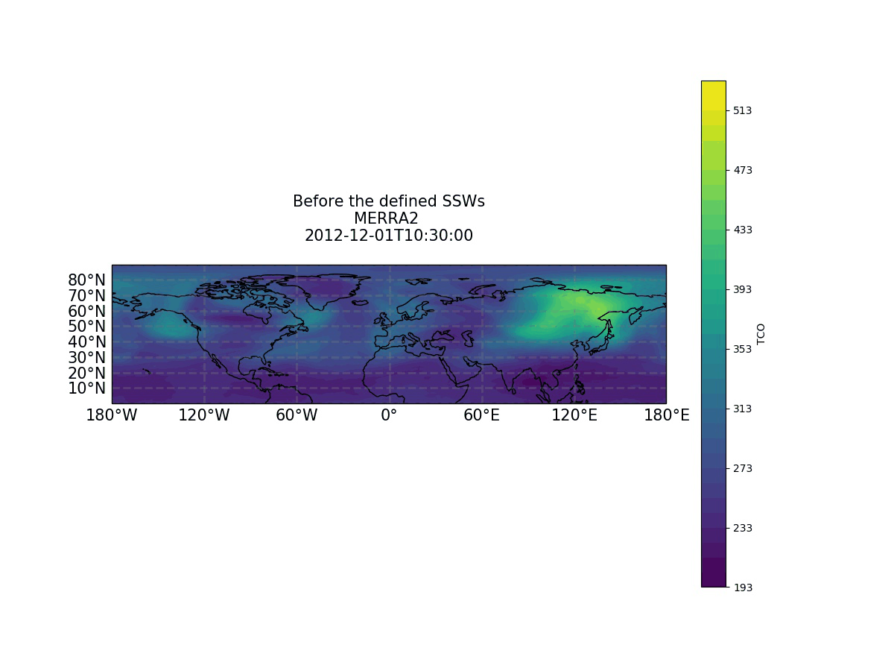

# Data Visualization in Python

## Description

Take data and turn it into something colorful, graphical and meaningful. An introduction to basic data visualization tools combined into Jupyter tutorials. This repository will focus on plotting techniques in Python using [Matplotlib](https://matplotlib.org), [Seaborn](https://seaborn.pydata.org) & [Bokeh](https://docs.bokeh.org/en/latest/#)

## **Plots Gallery**


## **Animation Gallery**





## Introduction

Data visualization allows graphically represent data to extract and understand trends, outliers, patterns and further insights in the data. Data visualization helps you turn all that granular data into easily understood, visually compelling—and useful—science and business information.

Hidden within your data lie important insights that can help drive business forward. But the challenge is that you can’t always connect the dots by looking at raw numbers alone. When you look at your data presented in a visual format, patterns, connections, and other “a-ha” insights emerge that would otherwise remain out of sight.

Data visualization brings data to life, making you the master storyteller of the insights hidden within your numbers.

Python has many **many** graphing libraries with different features and it can be daunting to know which library to use.  This intro tutorial will focus on a few popular plotting libraries:

* **Pandas** - built on Matplotlib and easy to use with Pandas dataframes
* **Matplotlib** - massive library with lots of flexibility (stackoverflow will be your friend!)
* **Seaborn** - statistical visualization with default themes and beautiful styles
* **Bokeh**- interactive graphics

This repo compares Matplotlib, Pandas, Seaborn and Bokeh for the following visualizations:

* Scatter Plots
* Line Charts
* Histograms
* Bar Charts
* Box Plots
* Pie Charts
* Heatmaps
* Faceting
* Pairplots

## Setup

* Clone the repo!
* Unzip datasets in `/Python-Visualization/datasets/datasets.zip`
* Install or Upgrade the following packages:

```shell
pip install -upgrade matplotlib seaborn bokeh numpy pandas scikit-learn jupyter
```

## More Info

- [Python Graph Gallery](https://www.python-graph-gallery.com)
- [Seaborn Home](https://seaborn.pydata.org)
- [Seaborn Examples](https://seaborn.pydata.org/examples/index.html)
- [Bokeh Home](https://docs.bokeh.org/en/latest/#)
- [Bokeh Gallery](https://docs.bokeh.org/en/latest/docs/gallery.html)
- [Bokeh Periodic Table](https://docs.bokeh.org/en/latest/docs/gallery/periodic.html)
- [Geeks-for-Geeks Bokeh Tutorial](https://www.geeksforgeeks.org/python-bokeh-tutorial-interactive-data-visualization-with-bokeh)
- [Bokeh RealPython Tutorial](https://realpython.com/python-data-visualization-bokeh/)
- [TutorialsPoint Bokeh Plots with Glyphs](https://www.tutorialspoint.com/bokeh/bokeh_plots_with_glyphs.htm)
- [TutorialsPoint Bokeh Quick Guide](https://www.tutorialspoint.com/bokeh/bokeh_quick_guide.htm)

## Author

Vadim M - vasja34@gmail.com

---
